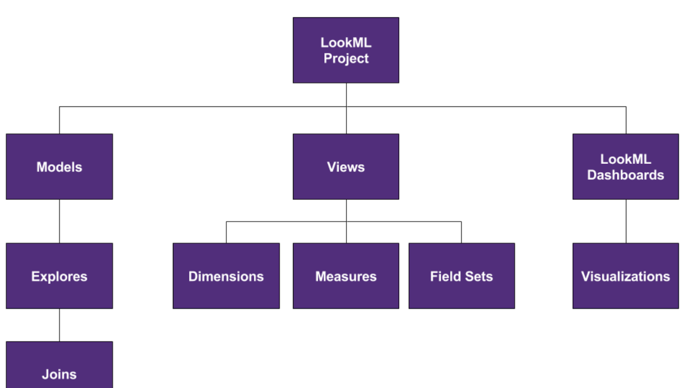

https://docs.looker.com/data-modeling/learning-lookml/advanced-lookml-concepts

https://www.youtube.com/watch?v=-YMCafO_cZk (ru)


### Agg tables in Looker
https://docs.looker.com/data-modeling/learning-lookml/aggregate_awareness


## Look / Scheduling / Alerts

Saving a Look - this saves all of your choices for filters, visualizations, fields, sorting, and so on.

https://docs.looker.com/sharing-and-publishing/scheduling-and-sharing/delivering-looks-explores

You may be able to drill into a value on your report.

#### Look Run on Load option:

Click the Look’s three-dot menu icon.
Select Edit Settings.
Click the Run on Load switch.
Click Save

https://docs.looker.com/sharing-and-publishing/viewing-looks

https://docs.looker.com/exploring-data/saving-and-editing-looks

## Referencing derived tables in other derived tables

https://docs.looker.com/data-modeling/learning-lookml/derived-tables#referencing_derived_tables_in_other_derived_tables

## Conditionally filter

https://docs.looker.com/reference/explore-params/conditionally_filter#examples

  conditionally_filter: {
    filters: [derived_amoeba_allocation.date_key_date : "10 days ago for 10 days"]

  }
  
## Approximate count

https://docs.looker.com/reference/field-params/approximate

  measure:  number_of_devices {
    type: count_distinct
    approximate: yes
    sql: ${TABLE}.number_of_devices ;;


## Helper explore for Filter dropdown:
```

 70   parameter: f_exp_id {  #  defined on Dashboard
 71     type: string
 72     suggest_explore:  dim_experiment
 73     suggest_dimension: dim_experiment.id
 74   }
 
```
### SQL_ALWAYS
```
explore: dim_experiment_firmware {
  view_name: dim_experiment
  label: "Amoeba Experiments for Firmware"
  description: "Amoeba Experiments for Firmware"
  sql_always_where:  ${end_date} > '2020-09-01' AND ${client} = 'player'  ;;
}
```


```
explore: dim_experiment {
  view_name: dim_experiment
  label: "Amoeba Firmware Experiments "
  description: "Amoeba Firmware Experiments"
  sql_always_where:  DATE(${start_date}) > '2020-12-01' AND ${client} = 'player' and ${is_active}=1 ;;
}

explore: agg_channel_cores_daily {
  label: "Channel Cores Metrics"
  description: "Core Firmware Crash Metrics for Channel, Platforms, Builds, Products, Date, etc."
  persist_with: datagroup_agg_channel_cores_daily
  join: dim_product {
    sql_on: ${agg_channel_cores_daily.product_id} = ${dim_product.product_id} ;;
    type:  left_outer
    relationship: many_to_one
  }
  join: dim_channel {
    sql_on: ${agg_channel_cores_daily.channel_id} = ${dim_channel.channel_id} ;;
    type:  left_outer
    relationship: many_to_one
  }
  # filter active_exp_map:
  sql_always_where:
     
          STRPOS(${agg_channel_cores_daily.active_exp_map} , XXX) > 0
      1 = 1 ;;
}
```
where XXX above 3 lines above is  
###### 


## Caching / persistance
<https://docs.looker.com/reference/view-params/persist_for-for-derived_table>

<https://docs.looker.com/reference/explore-params/persist_for-for-explore>

```
So measures of type number means that the measure will be an arihmethac of some sort.
https://docs.looker.com/reference/field-reference/measure-type-reference#number
Sorry, not aggregation, I mean arithmancy. For example, it'll look something like so: 

measure: total_gross_margin_percentage {
  type: number
  value_format_name: percent_2
  sql: ${total_gross_margin}/ NULLIF(${total_sale_price},0) ;;
}
```
Where we're performing arithmancy in the sql


https://discourse.looker.com/t/rows-to-columns/3992

```
view: xxx {
  derived_table: {
    sql: {
       SELECT 
          id
          , CASE WHEN custom_field = 'Type' then text_value ELSE NULL END as type
          , CASE WHEN custom_field = 'Department' then text_value ELSE NULL END as department
      FROM xxx
      GROUP BY 1,2,3
      ;;
    }
  }
   
  dimension: id {}
  dimension: type {} 
  dimension: department {}
}
```

## Pivot
And our table calc will be a bit different. The new syntax will be:

pivot_index(${view_name.measure_name},2) - pivot_index(${view_name.measure_name},1)

## General Questions

<https://help.looker.com/hc/en-us/articles/360023640634-Dynamic-Measures-with-Parameters>

<https://help.looker.com/hc/en-us/articles/360023573273-Great-Use-Cases-for-Parameter-Fields>

<https://help.looker.com/hc/en-us/articles/360041919653-How-to-Dimensionalize-a-Measure-in-Looker>


<https://www.acrotrend.com/deep-dive-on-looker-liquid-parameter-and-templated-filters/>

<https://help.looker.com/hc/en-us/articles/360023624034-Advanced-Templated-Filters>

<https://docs.looker.com/data-modeling/learning-lookml/working-with-joins#joins_start_with_an_explore>

https://docs.looker.com/reference/field-params/suggest_dimension

### Combine

<https://docs.looker.com/exploring-data/exploring-data/merged-results#saving_your_merged_results_to_a_dashboard>
 
<https://discourse.looker.com/t/how-to-combine-2-views-explores/18308>

```
Looker doesn't have type: stddev, so we would need to achieve it in `sql`. So the steps are:

1) Find the SQL function of your dialect that gives us the stddev()
2) Make a dimension (type: number) with the sql: sttdev();
3) Make a measure (type: number) that reference the dimension above

-- we have to make a dimension first before a measure otherwise we will run into aggregation of aggregation, which most SQL dialects can not do.


create  a count measure  

  measure: AVOD_Movies_count {  
    label: "AVOD Movies Record count() "
    type: count   
    sql: ${TABLE}.device_id;;
    filters:  [economic_model  : "AVOD", content_type: "movie" ]
  }
  

mean(pivot_index(${measure},1)) - mean(${measure})/
sqrt(
stddev_pop(pivot_index(${measure},1)*2/pivot_index(${mesure},1))
+
stddev_pop(${measure}*2/${measure})

Where ${measure} is n_current and pivot_index(${mesure},1) is n_control


 in terms of being able to filter those experiment and date-range fields _before_ the join, we sort of have two options.

The first option would be to put that filter logic inside of the sql_on parameter in the join. For example:
join: view_2 {
sql_on: ${view_2.bucket} = ${view_1.bucket} AND ${view_2.date} > 'mm-dd-yyyy' AND ${view_2.experiment} = 'value'
}

The other option would be to turn that view into a derived table (), where we could apply that filter in the sql of the derived table, or the generated SQL from a native derived table.

If we wanted users to be able to input the values for bucket and date range, that could be implemented using a templated filter (the documentation for templated filters is also the same that we discussed in relation to parameters  above: ). 
Or if you opt to go the native derived table route, the filtering may look slightly different:


During the creation of the dashboard filter, you'll need to point it to the templated filter that exists in the explore
- It should be an option similar to what's being shown in step 3 or 5*  here: 
```
<https://docs.looker.com/dashboards/adding-filters-to-user-dashboards#adding_dashboard_filters_a_user_can_change>
```
Where in this example they are pointing the filter to a field called 'Count' in the 'Thelook Ecommerce' model and 'Order Items' explore, we'd be able to set this as the templated filter, as well as the fields it's being applied to in step 6.
 
```

```
 SELECT 
…
 WHERE
        {  condition filter_name  } database_field_name { endcondition  }
UNION ALL

SELECT
…
 WHERE
        {  condition filter_name  } database_field_name {  endcondition  }
UNION ALL
;;

## use this filter as the ‘field to update’ in the dashboard filter
filter: filter_name{}
```

## Dashboards examples:
seconds_streamed < 60 THEN
<https://dashboards.bdp.roku.com/explore/device_usage_related/agg_device_livetv_usage_metrics_tz?qid=1vQjAHoYqiGaJ4EzOwoGwu&origin_space=2156&toggle=vis>

<https://dashboards.bdp.roku.com/dashboards/3666>


```
 - drill_fields
 - dimention_group
 - join in measure 
 - vs derived 
 - SQL_always
 - bind filter
```
Specific questions:
```
 - average streaming hours: strraming hours / number of devices
 - kids time 
 - AVOD / TVOD /SVOD definition ???
 - ad impression . 
 - fact_amoeva_allocation vs dea
```

Dashboard Faced filter: 
<https://vimeo.com/347837657>

### combine explores
<https://docs.looker.com/exploring-data/exploring-data/merged-results> combine explores
```
  A view translates to essentially a SQL table + all the transformations you might want to do off of that one table. An explore translates to a collection of these tables. 

With the above in mind, we can join views together at the explore level. In a model file, 
once you have defined an explore, you can join other view files to that explore using the join:{} parameter.  

Essentially it means that you can just define views for your tables, and then join them in LookML without having to create a new view file and write a new derived table every time you want to join two tables to one another
The two parameters you mentioned are also explore level parameters, with differing purposes. see: 
```
### always_join parameter 
 
accepts a list of LookML joins (defined in your explore) that Looker will always execute when querying a given explore. 

### sql_always_having 
accepts a SQL snippet that Looker will always insert into the HAVING clause of an explore's query.
 
 https://help.looker.com/hc/en-us/articles/360001286007-Creating-Filtered-Measures-
 

###  sql for Dimensions
```
The sql block for dimensions can generally take any valid SQL that would go into a single column of a SELECT statement. These statements generally rely on Looker’s substitution operator, which has several forms:

${TABLE}.column_name references a column in the table that is connected to the view you’re working on.
${dimension_name} references a dimension within the view you’re working on.
${view_name.dimension_name} references a dimension from another view.
${view_name.SQL_TABLE_NAME} references another view or derived table. (Note that SQL_TABLE_NAME in this reference is a literal string; you do not need to replace it with anything.)
If sql is left unspecified, then Looker assumes that there is a column in the underlying table with the same name as the field. For example, selecting a field called city without a sql parameter would be equivalent to specifying sql: ${TABLE}.city.


We can use table calcs for this. Let's say we want to calculate "row 2 minus row 1" since the measure for the second selection is in row 2 and the measure for the first selection is in row 1.

The syntax would be: offset(${view_name.measure_name}, 1) - ${view_name.measure_name}
offset(${view_name.measure_name}, 1) --> this basically says "take the value of the next row of measure_name"

 ${view_name.measure_name} --> this is "value of measure_name in this row"
```
### Measures as rows
following is based on

<https://help.looker.com/hc/en-us/articles/360023862233-Transpose-Table-Display-Measures-as-Rows->

### derived_trc_amoeba_kpi.view

Custom fields:   
#### v
```
coalesce(
 if(row()=1, ${derived_trc_amoeba_kpi.allocated_devices}, null),
 
 if(row()=2, index(${derived_trc_amoeba_kpi.devices_on_trc}, 1), null),
 if(row()=3, index(${derived_trc_amoeba_kpi.Total_hours}, 1), null),
 if(row()=4, index(${derived_trc_amoeba_kpi.AVOD_hours}, 1), null),
 if(row()=5, index(${derived_trc_amoeba_kpi.AVOD_movies_hours}, 1), null),
 if(row()=6, index(${derived_trc_amoeba_kpi.AVOD_series_hours}, 1), null),
 if(row()=7, index(${derived_trc_amoeba_kpi.SVOD_hours}, 1), null),
 if(row()=8, index(${derived_trc_amoeba_kpi.SVOD_movies_hours}, 1), null),
 if(row()=9, index(${derived_trc_amoeba_kpi.SVOD_series_hours}, 1), null),
 if(row()=10, index(${derived_trc_amoeba_kpi.Livefeed_hours}, 1), null),
 if(row()=11, index(${derived_trc_amoeba_kpi.Kids_hours}, 1), null),
 
 if(row()=12, index(${derived_trc_amoeba_kpi.Active_on_TRC_percentage}, 1), null),
 if(row()=13, index(${derived_trc_amoeba_kpi.Avg_Total_hours}, 1), null),
 if(row()=14, index(${derived_trc_amoeba_kpi.Avg_AVOD_hours}, 1), null),
 if(row()=15, index(${derived_trc_amoeba_kpi.Avg_AVOD_movies_hours}, 1), null),
 if(row()=16, index(${derived_trc_amoeba_kpi.Avg_AVOD_series_hours}, 1), null),
 if(row()=17, index(${derived_trc_amoeba_kpi.Avg_SVOD_hours}, 1), null),
 if(row()=18, index(${derived_trc_amoeba_kpi.Avg_SVOD_movies_hours}, 1), null),
 if(row()=19, index(${derived_trc_amoeba_kpi.Avg_SVOD_series_hours}, 1), null),
 if(row()=20, index(${derived_trc_amoeba_kpi.Avg_Livefeed_hours}, 1), null),
 if(row()=21, index(${derived_trc_amoeba_kpi.Avg_Kids_hours}, 1), null),
 
 null)
 ```
 
 ### Z-score

```
coalesce(
if(row()=1, 0, null),
if(row()=2, 0, null),

if(row()=3,  ( index(${derived_trc_amoeba_kpi.mean_Total},1) - 
   pivot_where(contains(${derived_trc_amoeba_kpi.bucket}, "#Control"), index(${derived_trc_amoeba_kpi.mean_Total},1))
)/
sqrt(index(${derived_trc_amoeba_kpi.std2_Total_cnt},1) +
pivot_where(contains(${derived_trc_amoeba_kpi.bucket}, "#Control"), index(${derived_trc_amoeba_kpi.std2_Total_cnt},1))
), null),
# --- AVOD  
if(row()=4,  ( index(${derived_trc_amoeba_kpi.mean_AVOD},1) - 
   pivot_where(contains(${derived_trc_amoeba_kpi.bucket}, "#Control"), index(${derived_trc_amoeba_kpi.mean_AVOD},1))
)/
sqrt(index(${derived_trc_amoeba_kpi.std2_AVOD_cnt},1) +
pivot_where(contains(${derived_trc_amoeba_kpi.bucket}, "#Control"), index(${derived_trc_amoeba_kpi.std2_AVOD_cnt},1))
), null),
# --- AVOD movies
if(row()=5,  ( index(${derived_trc_amoeba_kpi.mean_AVOD_movies},1) - 
   pivot_where(contains(${derived_trc_amoeba_kpi.bucket}, "#Control"), index(${derived_trc_amoeba_kpi.mean_AVOD_movies},1))
)/
sqrt(index(${derived_trc_amoeba_kpi.std2_AVOD_movies_cnt},1) +
pivot_where(contains(${derived_trc_amoeba_kpi.bucket}, "#Control"), index(${derived_trc_amoeba_kpi.std2_AVOD_movies_cnt},1))
), null),
# --- AVOD series
if(row()=6,  ( index(${derived_trc_amoeba_kpi.mean_AVOD_series},1) - 
   pivot_where(contains(${derived_trc_amoeba_kpi.bucket}, "#Control"), index(${derived_trc_amoeba_kpi.mean_AVOD_series},1))
)/
sqrt(index(${derived_trc_amoeba_kpi.std2_AVOD_series_cnt},1) +
pivot_where(contains(${derived_trc_amoeba_kpi.bucket}, "#Control"), index(${derived_trc_amoeba_kpi.std2_AVOD_series_cnt},1))
), null),
# --- SVOD  
if(row()=7,  ( index(${derived_trc_amoeba_kpi.mean_SVOD},1) - 
   pivot_where(contains(${derived_trc_amoeba_kpi.bucket}, "#Control"), index(${derived_trc_amoeba_kpi.mean_SVOD},1))
)/
sqrt(index(${derived_trc_amoeba_kpi.std2_SVOD_cnt},1) +
pivot_where(contains(${derived_trc_amoeba_kpi.bucket}, "#Control"), index(${derived_trc_amoeba_kpi.std2_SVOD_cnt},1))
), null),
# --- SVOD movies
if(row()=8,  ( index(${derived_trc_amoeba_kpi.mean_SVOD_movies},1) - 
   pivot_where(contains(${derived_trc_amoeba_kpi.bucket}, "#Control"), index(${derived_trc_amoeba_kpi.mean_SVOD_movies},1))
)/
sqrt(index(${derived_trc_amoeba_kpi.std2_SVOD_movies_cnt},1) +
pivot_where(contains(${derived_trc_amoeba_kpi.bucket}, "#Control"), index(${derived_trc_amoeba_kpi.std2_SVOD_movies_cnt},1))
), null),
# --- SVOD series
if(row()=9,  ( index(${derived_trc_amoeba_kpi.mean_SVOD_series},1) - 
   pivot_where(contains(${derived_trc_amoeba_kpi.bucket}, "#Control"), index(${derived_trc_amoeba_kpi.mean_SVOD_series},1))
)/
sqrt(index(${derived_trc_amoeba_kpi.std2_SVOD_series_cnt},1) +
pivot_where(contains(${derived_trc_amoeba_kpi.bucket}, "#Control"), index(${derived_trc_amoeba_kpi.std2_SVOD_series_cnt},1))
), null),
# --- Live
if(row()=10,  ( index(${derived_trc_amoeba_kpi.mean_Live},1) - 
   pivot_where(contains(${derived_trc_amoeba_kpi.bucket}, "#Control"), index(${derived_trc_amoeba_kpi.mean_Live},1))
)/
sqrt(index(${derived_trc_amoeba_kpi.std2_Live_cnt},1) +
pivot_where(contains(${derived_trc_amoeba_kpi.bucket}, "#Control"), index(${derived_trc_amoeba_kpi.std2_Live_cnt},1))
), null),
# --- Kids
if(row()=11,  ( index(${derived_trc_amoeba_kpi.mean_Kids},1) - 
   pivot_where(contains(${derived_trc_amoeba_kpi.bucket}, "#Control"), index(${derived_trc_amoeba_kpi.mean_Kids},1))
)/
sqrt(index(${derived_trc_amoeba_kpi.std2_Kids_cnt},1) +
pivot_where(contains(${derived_trc_amoeba_kpi.bucket}, "#Control"), index(${derived_trc_amoeba_kpi.std2_Kids_cnt},1))
), null),


-- % of devices Active on TRC
if(row()=12, 
 (
   index(${derived_trc_amoeba_kpi.devices_on_trc    },1)
   /
   index(${derived_trc_amoeba_kpi.allocated_devices} ,1)
 )  
   - 
 (  pivot_where(contains(${derived_trc_amoeba_kpi.bucket}, "#Control"),        
    index(${derived_trc_amoeba_kpi.devices_on_trc},1) 
    /
    index(${derived_trc_amoeba_kpi.allocated_devices},1)
 )
/
sqrt(
   ${phat} * (1 - pivot_where(contains(${derived_trc_amoeba_kpi.bucket}, "#Control"), ${phat}) )
    *
   ( 
    (1.0 / index(${derived_trc_amoeba_kpi.devices_on_trc},1) +  
     1.0/ pivot_where(contains(${derived_trc_amoeba_kpi.bucket}, "#Control"),
          index(${derived_trc_amoeba_kpi.devices_on_trc},1)
   ) 
),
null),


row())
``` 

 
 ### Lift
 ```
(
  ${v} - pivot_where(contains(${derived_trc_amoeba_kpi.bucket}, "#Control"), ${v})  
)
/
pivot_where(contains(${derived_trc_amoeba_kpi.bucket}, "#Control"), ${v})
```

### phat

```
coalesce(
#--------------------------------
# -- 12 % devices active on TRC
#--------------------------------
if(row()=12,
  (
   index(${derived_trc_amoeba_kpi.devices_on_trc},1)
    *  index(${derived_trc_amoeba_kpi.devices_on_trc},1)
   / index(${derived_trc_amoeba_kpi.allocated_devices} ,1)

   +
 (
   pivot_where
   (contains(${derived_trc_amoeba_kpi.bucket}, "#Control"),
    index(${derived_trc_amoeba_kpi.devices_on_trc},1)
   )
   *
   pivot_where
   (contains(${derived_trc_amoeba_kpi.bucket}, "#Control"),
    index(${derived_trc_amoeba_kpi.devices_on_trc},1)
   )
    /
   pivot_where
   (contains(${derived_trc_amoeba_kpi.bucket}, "#Control"),
    index(${derived_trc_amoeba_kpi.allocated_devices},1)
   )
 )
 )
  /
  ( index(${derived_trc_amoeba_kpi.devices_on_trc},1)
  +
     pivot_where
   (contains(${derived_trc_amoeba_kpi.bucket}, "#Control"),
    index(${derived_trc_amoeba_kpi.devices_on_trc},1)
   )
  ),

null
),
#--------------------------------
# -- 13 % Avg Total Hours
#--------------------------------
if(row()=13,

  (
   index(${derived_trc_amoeba_kpi.mean_Total},1)
    *  index(${derived_trc_amoeba_kpi.count_Total},1)
   / index(${derived_trc_amoeba_kpi.allocated_devices} ,1)

   +
 (
   pivot_where
   (contains(${derived_trc_amoeba_kpi.bucket}, "#Control"),
    index(${derived_trc_amoeba_kpi.mean_Total},1)
   )
   *
   pivot_where
   (contains(${derived_trc_amoeba_kpi.bucket}, "#Control"),
    index(${derived_trc_amoeba_kpi.count_Total},1)
   )
    /
   pivot_where
   (contains(${derived_trc_amoeba_kpi.bucket}, "#Control"),
    index(${derived_trc_amoeba_kpi.allocated_devices},1)
   )
 )
 )
  /
  ( index(${derived_trc_amoeba_kpi.count_Total},1)
  +
     pivot_where
   (contains(${derived_trc_amoeba_kpi.bucket}, "#Control"),
    index(${derived_trc_amoeba_kpi.count_Total},1)
   )
  ),

null
),

#--------------------------------
# -- 14 % Avg AVOD Hours
#--------------------------------
if(row()=14,

  (
   index(${derived_trc_amoeba_kpi.mean_AVOD},1)
    *  index(${derived_trc_amoeba_kpi.count_AVOD},1)
   / index(${derived_trc_amoeba_kpi.allocated_devices} ,1)

   +
 (
   pivot_where
   (contains(${derived_trc_amoeba_kpi.bucket}, "#Control"),
    index(${derived_trc_amoeba_kpi.mean_AVOD},1)
   )
   *
   pivot_where
   (contains(${derived_trc_amoeba_kpi.bucket}, "#Control"),
    index(${derived_trc_amoeba_kpi.count_AVOD},1)
   )
    /
   pivot_where
   (contains(${derived_trc_amoeba_kpi.bucket}, "#Control"),
    index(${derived_trc_amoeba_kpi.allocated_devices},1)
   )
 ) 
 )
  /
  ( index(${derived_trc_amoeba_kpi.count_AVOD},1) 
  + 
     pivot_where
   (contains(${derived_trc_amoeba_kpi.bucket}, "#Control"),
    index(${derived_trc_amoeba_kpi.count_AVOD},1)
   )
  ),

null
), 

#--------------------------------
# -- 15 % Avg_AVOD_movies_hours
#--------------------------------
if(row()=15,

  (
   index(${derived_trc_amoeba_kpi.mean_AVOD_movies},1)
    *  index(${derived_trc_amoeba_kpi.count_AVOD_movies},1)
   / index(${derived_trc_amoeba_kpi.allocated_devices} ,1)

   +
 (
   pivot_where
   (contains(${derived_trc_amoeba_kpi.bucket}, "#Control"),
    index(${derived_trc_amoeba_kpi.mean_AVOD_movies},1)
   )
   *
   pivot_where
   (contains(${derived_trc_amoeba_kpi.bucket}, "#Control"),
    index(${derived_trc_amoeba_kpi.count_AVOD_movies},1)
   )
    /
   pivot_where
   (contains(${derived_trc_amoeba_kpi.bucket}, "#Control"),
    index(${derived_trc_amoeba_kpi.allocated_devices},1)
   )
 ) 
 )
  /
  ( index(${derived_trc_amoeba_kpi.count_AVOD_movies},1) 
  + 
     pivot_where
   (contains(${derived_trc_amoeba_kpi.bucket}, "#Control"),
    index(${derived_trc_amoeba_kpi.count_AVOD_movies},1)
   )
  ),

null
),

#--------------------------------
# -- 16 % Avg_AVOD_series_hours
#--------------------------------
if(row()=16,

  (
   index(${derived_trc_amoeba_kpi.mean_AVOD_series},1)
    *  index(${derived_trc_amoeba_kpi.count_AVOD_series},1)
   / index(${derived_trc_amoeba_kpi.allocated_devices} ,1)

   +
 (
   pivot_where
   (contains(${derived_trc_amoeba_kpi.bucket}, "#Control"),
    index(${derived_trc_amoeba_kpi.mean_AVOD_series},1)
   )
   *
   pivot_where
   (contains(${derived_trc_amoeba_kpi.bucket}, "#Control"),
    index(${derived_trc_amoeba_kpi.count_AVOD_series},1)
   )
    /
   pivot_where
   (contains(${derived_trc_amoeba_kpi.bucket}, "#Control"),
    index(${derived_trc_amoeba_kpi.allocated_devices},1)
   )
 ) 
 )
  /
  ( index(${derived_trc_amoeba_kpi.count_AVOD_series},1) 
  + 
     pivot_where
   (contains(${derived_trc_amoeba_kpi.bucket}, "#Control"),
    index(${derived_trc_amoeba_kpi.count_AVOD_series},1)
   )
  ),

null
), 

#--------------------------------
# -- 17 % Avg_SVOD_hours
#--------------------------------
 if(row()=17,

  (
   index(${derived_trc_amoeba_kpi.mean_SVOD},1)
    *  index(${derived_trc_amoeba_kpi.count_SVOD},1)
   / index(${derived_trc_amoeba_kpi.allocated_devices} ,1)

   +
 (
   pivot_where
   (contains(${derived_trc_amoeba_kpi.bucket}, "#Control"),
    index(${derived_trc_amoeba_kpi.mean_SVOD},1)
   )
   *
   pivot_where
   (contains(${derived_trc_amoeba_kpi.bucket}, "#Control"),
    index(${derived_trc_amoeba_kpi.count_SVOD},1)
   )
    /
   pivot_where
   (contains(${derived_trc_amoeba_kpi.bucket}, "#Control"),
    index(${derived_trc_amoeba_kpi.allocated_devices},1)
   )
 ) 
 )
  /
  ( index(${derived_trc_amoeba_kpi.count_SVOD},1) 
  + 
     pivot_where
   (contains(${derived_trc_amoeba_kpi.bucket}, "#Control"),
    index(${derived_trc_amoeba_kpi.count_SVOD},1)
   )
  ),

null
), 

#--------------------------------
# -- 18 % Avg_SVOD_movies_hours
#--------------------------------
if(row()=18,

  (
   index(${derived_trc_amoeba_kpi.mean_SVOD_movies},1)
    *  index(${derived_trc_amoeba_kpi.count_SVOD_movies},1)
   / index(${derived_trc_amoeba_kpi.allocated_devices} ,1)

   +
 (
   pivot_where
   (contains(${derived_trc_amoeba_kpi.bucket}, "#Control"),
    index(${derived_trc_amoeba_kpi.mean_SVOD_movies},1)
   )
   *
   pivot_where
   (contains(${derived_trc_amoeba_kpi.bucket}, "#Control"),
    index(${derived_trc_amoeba_kpi.count_SVOD_movies},1)
   )
    /
   pivot_where
   (contains(${derived_trc_amoeba_kpi.bucket}, "#Control"),
    index(${derived_trc_amoeba_kpi.allocated_devices},1)
   )
 ) 
 )
  /
  ( index(${derived_trc_amoeba_kpi.count_SVOD_movies},1) 
  + 
     pivot_where
   (contains(${derived_trc_amoeba_kpi.bucket}, "#Control"),
    index(${derived_trc_amoeba_kpi.count_SVOD_movies},1)
   )
  ),

null
), 

#--------------------------------
# -- 19 % Avg_SVOD_series_hours
#--------------------------------
if(row()=19,

  (
   index(${derived_trc_amoeba_kpi.mean_SVOD_series},1)
    *  index(${derived_trc_amoeba_kpi.count_SVOD_series},1)
   / index(${derived_trc_amoeba_kpi.allocated_devices} ,1)

   +
 (
   pivot_where
   (contains(${derived_trc_amoeba_kpi.bucket}, "#Control"),
    index(${derived_trc_amoeba_kpi.mean_SVOD_series},1)
   )
   *
   pivot_where
   (contains(${derived_trc_amoeba_kpi.bucket}, "#Control"),
    index(${derived_trc_amoeba_kpi.count_SVOD_series},1)
   )
    /
   pivot_where
   (contains(${derived_trc_amoeba_kpi.bucket}, "#Control"),
    index(${derived_trc_amoeba_kpi.allocated_devices},1)
   )
 ) 
 )
  /
  ( index(${derived_trc_amoeba_kpi.count_SVOD_series},1) 
  + 
     pivot_where
   (contains(${derived_trc_amoeba_kpi.bucket}, "#Control"),
    index(${derived_trc_amoeba_kpi.count_SVOD_series},1)
   )
  ),

null
),

#--------------------------------
# -- 20 % Avg_Livefeed_hours
#--------------------------------
if(row()=20,

  (
   index(${derived_trc_amoeba_kpi.mean_Live},1)
    *  index(${derived_trc_amoeba_kpi.count_Live},1)
   / index(${derived_trc_amoeba_kpi.allocated_devices} ,1)

   +
 (
   pivot_where
   (contains(${derived_trc_amoeba_kpi.bucket}, "#Control"),
    index(${derived_trc_amoeba_kpi.mean_Live},1)
   )
   *
   pivot_where
   (contains(${derived_trc_amoeba_kpi.bucket}, "#Control"),
    index(${derived_trc_amoeba_kpi.count_Live},1)
   )
    /
   pivot_where
   (contains(${derived_trc_amoeba_kpi.bucket}, "#Control"),
    index(${derived_trc_amoeba_kpi.allocated_devices},1)
   )
 ) 
 )
  /
  ( index(${derived_trc_amoeba_kpi.count_Live},1) 
  + 
     pivot_where
   (contains(${derived_trc_amoeba_kpi.bucket}, "#Control"),
    index(${derived_trc_amoeba_kpi.count_Live},1)
   )
  ),

null
), 
#--------------------------------
# -- 21 % Avg_Kids_hours
#--------------------------------
if(row()=21,

  (
   index(${derived_trc_amoeba_kpi.mean_Kids},1)
    *  index(${derived_trc_amoeba_kpi.count_Kids},1)
   / index(${derived_trc_amoeba_kpi.allocated_devices} ,1)

   +
 (
   pivot_where
   (contains(${derived_trc_amoeba_kpi.bucket}, "#Control"),
    index(${derived_trc_amoeba_kpi.mean_Kids},1)
   )
   *
   pivot_where
   (contains(${derived_trc_amoeba_kpi.bucket}, "#Control"),
    index(${derived_trc_amoeba_kpi.count_Kids},1)
   )
    /
   pivot_where
   (contains(${derived_trc_amoeba_kpi.bucket}, "#Control"),
    index(${derived_trc_amoeba_kpi.allocated_devices},1)
   )
 ) 
 )
  /
  ( index(${derived_trc_amoeba_kpi.count_Kids},1) 
  + 
     pivot_where
   (contains(${derived_trc_amoeba_kpi.bucket}, "#Control"),
    index(${derived_trc_amoeba_kpi.count_Kids},1)
   )
  ),

null
), 

null)
```
###  Confidence 95%

if (abs(${z_test})>=1.96, "Yes", "No")
 
 
<https://docs.looker.com/reference/explore-params/cancel_grouping_fields>

<https://www.youtube.com/watch?v=l0ajePzSe4E&list=PL2rFVcDw2yVoXlI3onYS7Ecufjg2ODI9u>


So, for example, we might have this filter field defined:
```
  filter: order_region {
    type: string
  }
```

And, we might also have this dimension defined in the same view file:
```
dimension: region {
    type: string
    sql: ${TABLE}.region ;;
}
```
Then, we could reference both of these in the `WHERE` clause of the derived table:
```
view: customer_facts {
  derived_table: {
    sql:
      SELECT
        customer_id,
        SUM(sale_price) AS lifetime_spend
      FROM
        order
      WHERE
        {\% condition order_region \%} order.region {\% endcondition \%}
    ;;
  }
 
This uses the Liquid `{\% condition filter_name \%} sql_or_lookml_reference {\% endcondition \%}` variable.  This variable returns the value of the filter you ask for with `filter_name`, applied to the `sql_or_lookml_reference` as SQL.
The templated filter tags are always transformed into a logical expression. For example, if the user entered “Northeast” into the `order_region` filter, Looker would turn the Liquid into: 
 
order.region = 'Northeast'
```

<https://discourse.looker.com/t/how-to-create-dynamic-date-filter-for-user/14370/3>

<https://docs.looker.com/data-modeling/learning-lookml/templated-filters>


<https://dashboards.bdp.roku.com/folders/1477> . dashboards

<https://help.looker.com/hc/en-us/articles/360001286007-Creating-Filtered-Measures->

<https://docs.looker.com/exploring-data/exploring-data>

<https://docs.looker.com/video-library/exploring-data> . Video

```
1) create a parameter as outlined here 
<https://docs.looker.com/reference/field-params/parameter>
, which is what the user will interact with, notice that we can limit user input to particular values you specify via "allowed values" 

2) We'll tie that parameter to conditional logic in a dimension that will dynamically change the underlying sql query based on the user input


So the first part is we'd create a parameter like this: 

 parameter: limited_date_filter {
    type: string
    allowed_value: { value: "Is in the past 7 Days" }
    allowed_value: { value: "Is in the past 30 Days" }
    allowed_value: { value: "All Dates" }
  }
  
and I'm seeing what we can do to link that to SQL logic that sums based on the selected value  

measure: total_sales {
    type: number
    sql: 
    {\% if limited_date_filter._parameter_value == "'Is in the past 7 Days'" \%}
    SUM(CASE WHEN ${your_date} BETWEEN GETDATE() AND Date >= CAST(DATEADD(day, -7, GETDATE())) THEN ${sale_price} END)
    {\% elsif limited_date_filter._parameter_value == "'Is in the past 30 Days'" \%}
    SUM(CASE WHEN ${your_date} BETWEEN GETDATE() AND Date >= CAST(DATEADD(day, -30, GETDATE())) THEN ${sale_price} END)
    
    and so on... ;;
  }
  
  
  measure: runningTotal{
     type: sum
     sql: ${TABLE}.“runningTotal” ;;
}
  
  Would recommend creating a dashboard with two tiles. One tile will be with a single-record chart () that will show experiment_id, start date, end date, etc
 ``` 
 
 <https://docs.looker.com/exploring-data/visualizing-query-results/single-record-options>
  
<https://training.looker.com/> mlubinsky@ho / LeVe>



### Model
Model files define Explores and their relationships to other views.

<https://dashboards.bdp.roku.com/projects/dea-foundation-prod/files/account_device_channel_related.model.lkml>

### Explore
<https://docs.looker.com/reference/explore-reference>
An Explore is a view that users can query. You can think of the Explore as a starting point for a query, or in SQL terms, as the FROM in a SQL statement. Not all views are Explores, because not all views describe an entity of interest.

An Explore serves as the starting point for a query in the Looker application. Explores reference views and each Explore can contain joins to other views. Explores should typically be declared in a model file.

```
connection: "dea_redshift_-_analytics_prod"   => dea_redshift_-_analytics_dev

explore: dim_experiment{
  label: "Amoeba experiment"
  description: "Amoeba A/B experiments"
  =>! view_name: agg_channel_subscription_metrics_time_grain
  join: another_table {
    sql_on:
    type:
    relationship: many_to_one . | one_to_one
  }
  join:  {
  } ...
  always_filter {
       filters: {
                field:
                value:
                }
       filters: {
                field:
                value:
                }
                
  }
  
}
```
### View:
A view is stored in a .view.lkml file.

A view declaration defines a list of fields (dimensions or measures) and their linkage to an underlying table or ```derived table```.

 GUI: Create View from Table
 <https://dashboards.bdp.roku.com/projects/dea-foundation-prod/files/agg_amoeba_trc_kpi_daily.view.lkml>

<https://docs.looker.com/reference/view-reference>

<https://dashboards.bdp.roku.com/projects/dea-foundation-prod/files/agg_amoeba_reports.view.lkml>

<https://dashboards.bdp.roku.com/projects/dea-foundation-prod/files/agg_amoeba_allocation_events_daily.view.lkml>

<https://dashboards.bdp.roku.com/projects/dea-foundation-prod/files/agg_amoeba_allocation_events.view.lkml>

Example:
```
view: agg_amoeba_allocation_events {
  sql_table_name: dea.agg_amoeba_allocation_events ;;

  dimension: account_id {
    type: string
    sql: ${TABLE}.account_id ;;
  }
  
  set: first_set {
    fields: [field_one, field_two]
  }
```
  
  
  
Defines:
```
- derived table
- measure, 
- dimensions, 
- filters
```

<https://docs.looker.com/exploring-data/creating-looker-expressions/looker-functions-and-operators>

<https://docs.looker.com/data-modeling/learning-lookml/lookml-terms-and-concepts>

### Derived table
<https://docs.looker.com/data-modeling/learning-lookml/derived-tables>

<https://docs.looker.com/data-modeling/learning-lookml/lookml-terms-and-concepts#derived-table> 

### Dimension_group

<https://docs.looker.com/reference/field-params/dimension_group>

```
  dimension_group: created {
    type: time
    timeframes: [date, week]
    sql: ${TABLE}.created_at ;;
  }
```
<https://looker.com/guide>

<https://discourse.looker.com/>

<https://github.com/looker-open-source>

<https://github.com/alison985/awesome-looker>

<https://docs.looker.com/reference/field-reference/dimension-type-reference>

In Looker, queries are grouped by the model to which they belong. Your users see models listed under the Explore menu:

```
model: (.model.lkml)  which tables to use and how they should be joined together and Explores

explore:  defined within a model file, but if you’re working with native derived tables you might make it its own file.
 Each Explore declaration includes join logic to join any view that Looker can determine is related to the Explore.
An Explore is a view that users can query.
 
view: (.view.lkml) define the view, its dimensions and measures, and its field sets.

join: lets you combine data from multiple views

dimension - is a groupable field (inside view)  and can be used to filter query results.

dimension_group:   example -  duration dimension,  dimension group specify diffrent units of measure

measure -  is a field that uses a SQL aggregate function, such as COUNT, SUM, AVG, MIN, or MAX. Any field computed based on the values of other measure values is also a measure. Measures can be used to filter grouped values. For example, measures for a Sales view might include total items sold (a count), total sale price (a sum), and average sale price (an average).

set . ???

Parameters in Looker increase interactivity for users and provide flexibility from the front end perspective without having to write custom code for each and every field the user asks for.
```
### Liquid variables
<https://docs.looker.com/reference/liquid-variables>

<https://blog.redpillanalytics.com/how-to-create-a-basic-parameter-in-looker-using-a-liquid-variable-e97d2b9b4669>

### Filters

<https://discourse.looker.com/t/how-to-create-dynamic-date-filter-for-user/14370/3>
Attributes:
  - allow_multiple_values: true | false
  - required: true | false

If You Want Filters A User Can Change, But Not Remove, Consider always_filter
If you want to force users to use a specific set of filters, but where the default value can be changed, try always_filter instead.

Example: 
the filter is given a numeric value. 
The measure will add only orders that have a price of more than 100:
```
measure: sales_18_to_25 {
  type: sum
  filters: [customers.age: ">=18 AND <=25"]
  sql: ${orders.price} ;;
}
```

<https://docs.looker.com/reference/filter-expressions>

<https://redpillanalytics.com/combining-advanced-and-custom-filters-in-looker/>

<https://blog.redpillanalytics.com/combining-advanced-and-custom-filters-in-looker-2c45590d1129>

Range filter

<https://discourse.looker.com/t/date-range-filter-with-relative-dates/11507/5>

### Custom dimentions templetated filters

<https://docs.looker.com/data-modeling/learning-lookml/templated-filters>
```
view: customer_facts {
  derived_table: {
    sql:
      SELECT
        customer_id,
        SUM(sale_price) AS lifetime_spend
      FROM
        order
      WHERE
        {\% condition order_region \%} order.region {\% endcondition \%}
    ;;
  }
·
  filter: order_region {
    type: string
  }
}
```
<https://help.looker.com/hc/en-us/articles/360001285847-Timeframe-vs-Timeframe-Analysis-Using-Templated-Filters>

### Looker API

https://docs.looker.com/reference/api-and-integration/api-getting-started


https://www.youtube.com/watch?v=OEbttXD17lA A/B testing with looker


SQL block
<https://docs.looker.com/data-modeling/learning-lookml/sql-and-referring-to-lookml#sql_block> 

<https://docs.looker.com/video-library/data-modeling>

<https://docs.looker.com/data-modeling/learning-lookml/extends>  Looker has the option to extend Explores, views, and LookML dashboards so that you can reuse the code

<https://www.youtube.com/user/LookerData>


<https://docs.looker.com/data-modeling/learning-lookml/caching> Caching Queries

<https://looker.com/blog/data-science-with-looker-and-python-part-two> . Data Science with looker


<https://looker.com/blog>


### Lookml-tools
<https://discourse.looker.com/t/lookml-tools-better-looker-code-user-experience-and-data-governance/12877>
<https://ww-tech.github.io/lookml-tools/> 

### Programmatic LookML Generation
<https://www.youtube.com/watch?v=cdyn-KLwyfc> .   
<https://github.com/llooker/lookmlscript>

## Extension framework
<https://looker.com/blog/empowering-developers-to-create-powerful-custom-data-experiences>

## Snowflake

<https://blog.redpillanalytics.com/managing-snowflake-data-warehouse-compute-in-looker-e445543987b2>

<https://looker.com/blog/using-snowflake-mvs-in-looker>

