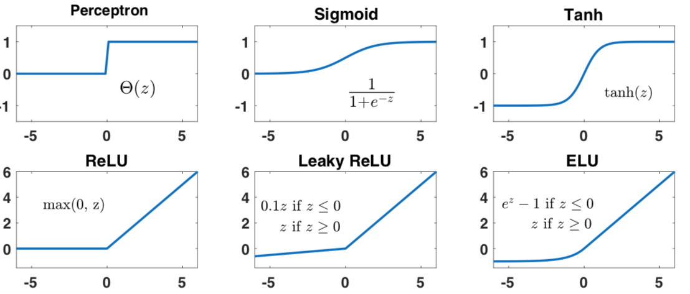

https://vickiboykis.com/what_are_embeddings/

https://habr.com/ru/articles/804119/ Attention is Not All You Need: как менялась архитектура трансформера

https://habr.com/ru/companies/megafon/articles/808585/

https://arxiv.org/ftp/arxiv/papers/2201/2201.00650.pdf Deep Learning interview

https://boramorka.github.io/LLM-Book/

https://udlbook.github.io/udlbook/  Understanding Deep Learning by Simon J.D. Prince

https://arxiv.org/pdf/2310.06251.pdf Deep Learning Tutorial

https://arxiv.org/pdf/2310.20360.pdf Math Introduction to Deep Learning

https://www.neelnanda.io/mechanistic-interpretability

https://www.linkedin.com/feed/update/urn:li:activity:7161083292249669632/

https://github.com/fastai/fastbook

https://habr.com/ru/companies/selectel/articles/808335/  Что такое дрифт ML-моделей и как его мониторить?
https://github.com/anthropics/anthropic-cookbook

### Embeddings

https://bawolf.substack.com/p/embeddings-are-a-good-starting-point

Embeddings are points in many-dimensional space, up to thousands of dimensions. 

### Transformers

https://www.youtube.com/watch?v=3hL1KCI5iVY

https://magazine.sebastianraschka.com/p/understanding-and-coding-self-attention

https://en.wikipedia.org/wiki/Transformer

https://arxiv.org/pdf/2207.09238.pdf Formal Algorithms for Transformers

https://osanseviero.github.io/hackerllama/blog/posts/random_transformer/

https://johnthickstun.com/docs/transformers.pdf

https://web.stanford.edu/~jurafsky/slp3/ transformer architecture.

 

https://news.ycombinator.com/item?id=29315107  Transformers from scratch

0. Лекция про трансформеры из курса, который я читал в магистратуре ВШЭ для биоинформатиков
https://github.com/che-shr-cat/deep-learning-for-biology-hse-2019-course
Лекция:
https://www.youtube.com/watch?v=uP_aL_78BcY

Слайды:  https://github.com/che-shr-cat/deep-learning-for-biology-hse-2019-course/blob/master/slides/%2312.%20Transformers.pdf

 
1. Transformer Zoo — рассказ про разнообразие трансформеров и их применений
https://www.youtube.com/watch?v=KZ9NXYcXVBY

2. Transformer Zoo (a deeper dive) — более глубокий рассказ про архитектуру и что в ней можно варьировать
https://www.youtube.com/watch?v=7e4LxIVENZA

3. Свежий рассказ про трансформеры в 2021 году
https://www.youtube.com/watch?v=8dN6ZVnDArk

Math for DeepLearning:

http://www.arxiv-sanity.com/2105.04026v1

### Chris Bishop

https://www.bishopbook.com/

https://issuu.com/cmb321/docs/deep_learning_ebook Deep Learning: Foundations and Concepts. Chris Bishop

https://www.microsoft.com/en-us/research/uploads/prod/2006/01/Bishop-Pattern-Recognition-and-Machine-Learning-2006.pdf

### Probabilistic Machine Learning: An Introduction by Kevin Patrick Murphy.
MIT Press, March 2022.
https://probml.github.io/pml-book/book1.html

https://probml.github.io/pml-book/book2.html  Advanced topics

### Courses 
https://fleuret.org/dlc/ DEEP LEARNING COURSE

https://d2l.ai/  Dive into Deep Learning

https://arxiv.org/pdf/2310.20360.pdf Mathematical Introduction to Deep Learning

https://www.catalyzex.com/paper/arxiv:2310.20360/code Code for Mathematical Introduction to Deep Learning

Understanding Neural Networks

https://arxiv.org/pdf/2106.10165.pdf  The Principles of Deep Learning Theory 

The Modern Mathematics of Deep Learning https://arxiv.org/abs/2105.04026

Geometric Deep Learning: Grids, Groups, Graphs, Geodesics, and Gauges https://arxiv.org/abs/2104.13478v2

https://fleuret.org/francois/lbdl.html  Little Book of Deep Learning 

Practical Deep Learning for Coders https://course.fast.ai/

https://youtube.com/playlist?list=PLTKMiZHVd_2KJtIXOW0zFhFfBaJJilH51&si=ocsN2zSPN7YsrGiY by Sebastian Raschka.

https://github.com/karpathy/nanoGPT

https://karpathy.ai/zero-to-hero.html Andrej Karpathy

https://www.deeplearningbook.org/ , PDF version: https://github.com/janishar/mit-deep-learning-book-pdf

 
### Large language models
https://github.blog/2023-10-30-the-architecture-of-todays-llm-applications/

https://sebastianraschka.com/blog/2023/llm-reading-list.html

The "Understanding Deep Learning" book:
https://udlbook.github.io/udlbook/ (free PDF and Jupyter notebooks available)

https://github.com/VikParuchuri/zero_to_gpt . Videos are all optional (cover the same content as the text).

https://arthurdouillard.com/deepcourse/

https://d2l.ai/

https://atcold.github.io/NYU-DLSP20/

https://m.youtube.com/playlist?list=PLoROMvodv4rNyWOpJg_Yh4NSqI4Z4vOYy machine learning lecture series (19 videos)

https://www.coursera.org/account/accomplishments/verify/8GHFJCCQ6G3T?utm_source=ln&utm_medium=certificate&utm_content=cert_image&utm_campaign=pdf_header_button&utm_product=course

https://news.ycombinator.com/item?id=38331200

https://yoshuabengio.org/

https://habr.com/ru/articles/753920/

### Meta-learning

https://ufn.ru/ru/articles/2022/5/b/

https://pub.towardsai.net/a-gentle-introduction-to-meta-learning-8e36f3d93f61 Metalearning

https://habr.com/ru/post/688820/

From zero to research — An introduction to Meta-learning by Thomas Wolf

(https://medium.com/huggingface/from-zero-to-research-an-introduction-to-meta-learning-8e16e677f78a)

### Leabra 

https://www.researchgate.net/publication/270960245_The_Leabra_Model_of_Neural_Interactions_and_Learning_in_the_Neocortex

https://emersim.org/

https://en.wikipedia.org/wiki/Leabra

https://github.com/emer/leabra

http://www.e-cortex.com/technology.html

http://psych.colorado.edu/~oreilly/pdp++/manual/pdp-user_235.html

https://www.labri.fr/perso/nrougier/

https://www.labri.fr/perso/nrougier/papers/10.1073.pnas.0502455102.pdf

https://ufn.ru/ru/articles/2022/5/b/

https://weightagnostic.github.io/. Weight agnostic NN

https://habr.com/ru/post/652295/

The Principles of Deep Learning Theory (book)
 https://arxiv.org/pdf/2106.10165.pdf

### Diff programming
https://www.assemblyai.com/blog/differentiable-programming-a-simple-introduction/

https://news.ycombinator.com/item?id=31000709

### 	The Principles of Deep Learning Theory

https://arxiv.org/abs/2106.10165

https://news.ycombinator.com/item?id=31051540

### Books

https://sebastianraschka.com/blog/2022/ml-pytorch-book.html

https://github.com/BoltzmannEntropy/interviews.ai

https://arxiv.org/abs/2201.00650

https://news.ycombinator.com/item?id=29876742

<https://d2l.ai/> Deep Learning book

https://arxiv.org/abs/2105.04026 math of deep learning

https://deeplearningmath.org/

https://rubikscode.net/deep-learning-for-programmers/

https://deeplearningsystems.ai/

<https://www.deeplearningbook.org/> 

<https://www.amazon.com/Deep-Learning-Python-Francois-Chollet/dp/1617294438> . Book

<https://www.amazon.com/Machine-Learning-Python-Cookbook-preprocessing/dp/1491989386/> . Book

<https://aiprobook.com/deep-learning-for-programmers/>

<https://www.elementsofai.com/>

<http://introtodeeplearning.com/>

https://atcold.github.io/NYU-DLSP21/

https://habr.com/ru/post/575520/  NN pruning 

https://ml-jku.github.io/hopfield-layers/ Hopfield network

### Automatic differentiation

TensorFlow, PyTorch, Jax, and Julia

http://www.stochasticlifestyle.com/engineering-trade-offs-in-automatic-differentiation-from-tensorflow-and-pytorch-to-jax-and-julia/

https://news.ycombinator.com/item?id=29682507

### TinyML

https://habr.com/ru/company/glowbyte/blog/559400/

###  How to visualize NN layers?
https://www.reddit.com/r/MachineLearning/comments/kmfx2d/d_can_anyone_recommend_a_network_architecture/

<https://github.com/lutzroeder/netron> viewer for many NN formats

https://math.mit.edu/ennui/   Elegant NN UI

<https://www.youtube.com/watch?v=M-2upGOuaPY>  Лекция 8. Р.В. Шамин. Функциональный анализ и машинное обучение

<https://arxiv.org/abs/2004.14545>  Explainable Deep Learning: A Field Guide for the Uninitiated 

<https://news.ycombinator.com/item?id=23060656>

RNN ans LSTM are dead:
https://habr.com/ru/post/561082/

<https://codelabs.developers.google.com/codelabs/cloud-tensorflow-mnist/#0> TensorFlow MNIST

<https://www.youtube.com/watch?v=bVQUSndDllU>   MNIST set recognision coded in python

http://amolkapoor.com/writing/index.html    Simple DL: A Guide to Building Deep Intuition About Deep Learning
 

<https://www.newworldai.com/advanced-deep-learning-course-deepmind/> . Youtube lectures

<https://thinc.ai/>

<https://distill.pub/2020/grand-tour/>

<https://www.youtube.com/watch?v=WsFasV46KgQ&feature=youtu.be> . Why sigmoid?

<https://www.quora.com/Whats-the-coolest-thing-youve-done-with-Python/answer/Neeramitra-Reddy?ch=99&share=14458bef&srid=NH5O>

<https://habr.com/ru/post/482794/>

<https://habr.com/ru/company/oleg-bunin/blog/470904/>

<https://habr.com/ru/post/467825/>

<https://medium.com/tensorflow/mit-deep-learning-basics-introduction-and-overview-with-tensorflow-355bcd26baf0>

<http://theprofessionalspoint.blogspot.com/2019/06/100-basic-deep-learning-interview.html>

<https://github.com/rasbt/deeplearning-models> 

<https://habr.com/ru/post/458724/>

<https://youtu.be/53YvP6gdD7U> Deep Learning State of Art in 2019 (MIT)

https://stepik.org/lesson/210100/step/1?unit=183577 .   STEPIC class

<https://github.com/Mybridge/amazing-machine-learning-opensource-2019>

<https://victorzhou.com/blog/intro-to-cnns-part-1/> . from scratch in Python

<https://towardsdatascience.com/10-new-things-i-learnt-from-fast-ai-v3-4d79c1f07e33> . FastAI

<https://chrisalbon.com/#deep_learning>

<https://www.youtube.com/watch?v=5l0e_Q0gpnc&list=PLlb7e2G7aSpT1ntsozWmWJ4kGUsUs141Y> . Нейронные сети. Теория (Анализ данных на Python в примерах и задачах. Ч2)

<https://lfdl.io/blog/2018/12/10/introducing-the-interactive-deep-learning-landscape/>

<http://tkipf.github.io/graph-convolutional-networks/>  GRAPH CONVOLUTIONAL NETWORKS

<http://ncollins.github.io/blog/2014/02/10/a-handwavey-explanation-of-the-metropolis-hastings-algorithm/>

<https://github.com/reshamas/fastai_deeplearn_part1> .  FastAI

<https://fullstackdeeplearning.com/march2019> . online course

<https://www.youtube.com/playlist?list=PLoROMvodv4rOABXSygHTsbvUz4G_YQhOb> . Stanford CS230 2018

<https://github.com/limberc/deeplearning.ai>

<https://www.reddit.com/r/MachineLearning/comments/bacu42/d_n_top_machine_learning_apis_that_you_should/>

<https://dlcourse.ai/> . russian class starts Feb 18

<https://deeplearning.mit.edu/> .  <https://github.com/lexfridman/mit-deep-learning> .   MIT

<https://blog.nanonets.com/hyperparameter-optimization/>

Dropout is a regularization technique proposed by Geoff Hinton that randomly sets activations in a neural network to 0 with a probability of pp. This helps prevent neural nets from overfitting (memorizing) the data as opposed to learning it.

pp is a hyperparameter.

Cyclic learning rates or stochastic gradient descent with warm restarts, 

https://habr.com/ru/company/otus/blog/561080/ Gradient variations

https://towardsdatascience.com/https-medium-com-reina-wang-tw-stochastic-gradient-descent-with-restarts-5f511975163

<https://www.coursera.org/learn/supervised-learning/home/welcome>  Обучение на размеченных данных

<https://stanford.edu/~shervine/teaching/cs-229/cheatsheet-deep-learning>

<https://stanford.edu/~shervine/teaching/cs-230/cheatsheet-recurrent-neural-networks>

<https://stanford.edu/~shervine/teaching/cs-230/cheatsheet-deep-learning-tips-and-tricks>

<https://stanford.edu/~shervine/teaching/cs-230/cheatsheet-convolutional-neural-networks>

<https://github.com/Yorko/mlcourse.ai>

 Dropout
 
 Xavier initialization:
 <https://prateekvjoshi.com/2016/03/29/understanding-xavier-initialization-in-deep-neural-networks/>
 
 Batch normalization  <https://en.wikipedia.org/wiki/Batch_normalization>
 <https://towardsdatascience.com/batch-normalization-in-neural-networks-1ac91516821c>
 
 Randomly horizontal flipping the train images
 
 Transfer Learning 

<https://deeplearningcourses.com/>

<https://www.analyticsvidhya.com/blog/category/deep-learning/>

<https://www.analyticsvidhya.com/blog/2018/12/best-data-science-machine-learning-projects-github/>

<https://deepnotes.io/>

<https://jaedukseo.me/>

<https://github.com/vivekstorm/AI-Resource>

<https://github.com/kmario23/deep-learning-drizzle>

<https://habr.com/ru/post/439688/>  Обзор AI & ML решений в 2018 году и прогнозы на 2019 год: Часть 1 
<https://habr.com/ru/post/439724/> . Обзор AI & ML решений в 2018 году и прогнозы на 2019 год: Часть 2 

<https://github.com/Mybridge/amazing-machine-learning-opensource-2019>

<https://habr.com/ru/post/414165/> . Курс о Deep Learning на пальцах

<https://www.youtube.com/channel/UCQj_dwbIydi588xrfjWSL5g/videos> . ru

<https://www.fast.ai/2019/01/24/course-v3/>

### Graph NN

https://habr.com/ru/company/mailru/blog/557280/

<https://news.ycombinator.com/item?id=18852974> .  Graph NN

<https://thegradient.pub/>

<https://www.reddit.com/r/MachineLearning/comments/anrams/d_sharing_my_personal_resource_list_for_deep/>
<https://gengo.ai/articles/best-20-ai-and-machine-learning-blogs-to-follow-religiously/>

<https://gengo.ai/articles/20-best-youtube-channels-for-ai-and-machine-learning/>

<https://github.com/Yorko/mlcourse.ai/tree/master/jupyter_russian>

<https://heartbeat.fritz.ai/classification-with-tensorflow-and-dense-neural-networks-8299327a818a>

## Code

<https://habr.com/ru/post/440190/> . python

<https://github.com/cosmic-cortex/neural-networks-from-scratch>

<https://spandan-madan.github.io/DeepLearningProject/>

<https://github.com/kaszperro/slick-dnn> Deep NN in pure python

## Image anaysis

<https://github.com/Merwanedr/Vusion> image analysis using AI

<https://github.com/Merwanedr/Popbot> . image transformation

## PyTorch

<https://github.com/Atcold/pytorch-Deep-Learning-Minicourse> . PyTorch

<https://github.com/vietnguyen91/Deeplab-pytorch>

## Keras

https://arxiv.org/pdf/2009.05673.pdf book

<https://github.com/keras-team/keras/tree/master/examples> Keras

<https://nextjournal.com/mpd/image-classification-with-keras> . Keras

 
## Classes

<https://www.bitdegree.org/user/course/python-image-recognition/player/1021>  course

<https://www.youtube.com/playlist?list=PLqYmG7hTraZDNJre23vqCGIVpfZ_K2RZs> . course

<https://www.reddit.com/r/MachineLearning/comments/a0xfc2/p_illustrated_deep_learning_cheatsheets_covering/>

<https://www.microsoft.com/en-us/research/publication/pattern-recognition-machine-learning/>

<https://medium.com/atlas-ml/state-of-deep-learning-h2-2018-review-cc3e490f1679> State of ML in 2018

## NN arhitecture

<https://www.youtube.com/watch?v=XY5AczPW7V4> .  Russ

<https://habr.com/company/nixsolutions/blog/430524/> . Архитектуры нейросетей

https://habr.com/post/433804/ . MNN

<https://habr.com/company/oleg-bunin/blog/340184/> .   NN Zoo

<https://arxiv.org/abs/1806.08342> .  Quantizing deep convolutional networks for efficient inference: A whitepaper

<https://arxiv.org/abs/1810.08533>   convolution and correlation using Fourier transform

### Autoencoders
https://www.nbshare.io/notebook/86916405/Understanding-Autoencoders-With-Examples/ 

<http://web.stanford.edu/class/cs294a/sparseAutoencoder.pdf>

<https://www.nvidia.ru/object/machine-learning-ai-nvidia-blog-ru.html>

<https://habr.com/company/intel/blog/429818/> Intel Vision Accelerator with Deep Learning

<https://habr.com/post/417209/> . Обзор курсов и статей на русском языке

<https://habr.com/post/414165/>  Курс о Deep Learning на пальцах

<https://habr.com/company/ods/blog/344044/> . Материалы открытого курса OpenDataScience 

<https://mlcourse.ai/>

<https://onnx.ai/>  common NN format

<http://rapids.ai/>

<https://www.analyticsvidhya.com/blog/category/deep-learning/>

<https://twitter.com/petewarden>

<https://twitter.com/lc0d3r>

<https://www.youtube.com/watch?v=o64FV-ez6Gw> Joel Grus - Livecoding Madness - Let's Build a Deep Learning Library

<https://bair.berkeley.edu/blog/2018/08/06/recurrent/>

<https://www.youtube.com/watch?v=Agv-SioIZac&list=PL-_cKNuVAYAUWTBKPpWbTGmo5zadoaeCk> russian

<https://jalammar.github.io/feedforward-neural-networks-visual-interactive/>

<https://deepnotes.io/>

<http://iamtrask.github.io/>

<https://stanford.edu/~shervine/teaching/cs-229/cheatsheet-deep-learning>

<https://stats.stackexchange.com/questions/154879/a-list-of-cost-functions-used-in-neural-networks-alongside-applications>

## Deep Learning

<https://www.youtube.com/watch?v=40mnpYTPpJg> .  Russian

<https://arxiv.org/abs/1810.01109> Deep Learning on Android

<http://www.deeplearningbook.org/> . BOOK

<https://www.youtube.com/playlist?list=PLldrX-tcWesPRtPAJuQkBo3drEMyAlV2c> .  complimentary youtube channel

<http://neuralnetworksanddeeplearning.com/index.html> . book

<https://github.com/rasbt/deep-learning-book> book

<https://blog.floydhub.com/guide-to-hyperparameters-search-for-deep-learning-models/>

<https://medium.com/octavian-ai/which-optimizer-and-learning-rate-should-i-use-for-deep-learning-5acb418f9b2>

<http://course.fast.ai/>

<https://www.zerotodeeplearning.com/>

<https://github.com/ysh329/deep-learning-model-convertor>

<https://www.youtube.com/watch?v=9X_4i7zdSY8&t=2s>

<https://datascience.stackexchange.com/questions/12851/how-do-you-visualize-neural-network-architectures>

<https://modelzoo.co/>

<http://cs231n.stanford.edu/slides/2018/>

## DL on Edge
<https://towardsdatascience.com/deep-learning-on-the-edge-9181693f466c>

<https://towardsdatascience.com/why-machine-learning-on-the-edge-92fac32105e6>

<https://medium.com/@bryancostanich/the-future-is-tiny-44dea02e4517>

## ARM
<https://www.dlology.com/blog/how-to-run-deep-learning-model-on-microcontroller-with-cmsis-nn/>
<https://www.youtube.com/watch?v=jlYDrmYJxh4>
<https://developer.arm.com/products/processors/machine-learning/>
<https://community.arm.com/processors/b/blog/posts/new-neural-network-kernels-boost-efficiency-in-microcontrollers-by-5x>
<https://github.com/ARM-software/CMSIS_5>
<https://www.slideshare.net/linaroorg/hkg18312-cmsisnn>

Given probability p, the corresponding odds are calculated as p / (1 – p). 
The logit function is simply the logarithm of the odds: logit(x) = log(x / (1 – x)).
The value of the logit function heads towards infinity as p approaches 1 and towards negative infinity as it approaches 0.

The logit function is useful in analytics because it maps probabilities (which are values in the range [0, 1]) to the full range of real numbers. In particular, if you are working with “yes-no” (binary) inputs it can be useful to transform them into real-valued quantities prior to modeling. This is essentially what happens in logistic regression.

The inverse of the logit function is the sigmoid function. That is, if you have a probability p, sigmoid(logit(p)) = p. The sigmoid function maps arbitrary real values back to the range [0, 1]. The larger the value, the closer to 1 you’ll get.

The formula for the sigmoid function is σ(x) = 1/(1 + exp(-x)).

## Vanishing gradient problem
<https://en.wikipedia.org/wiki/Vanishing_gradient_problem>

<https://www.quora.com/What-is-the-vanishing-gradient-problem>

Vanishing gradient problem depends on the choice of the activation function. Many common activation functions (e.g sigmoid or tanh) 'squash' their input into a very small output range in a very non-linear fashion. For example, sigmoid maps the real number line onto a "small" range of [0, 1]. As a result, there are large regions of the input space which are mapped to an extremely small range. In these regions of the input space, even a large change in the input will produce a small change in the output - hence the gradient is small.

We can avoid this problem by using activation functions which don't have this property of 'squashing' the input space into a small region. A popular choice is Rectified Linear Unit which maps 𝑥 to 𝑚𝑎𝑥(0,𝑥).

Rectified Linear activation function does not have this problem. The gradient is 0 for negative (and zero) inputs and 1 for positive inputs

<https://pythonprogramming.net/introduction-deep-learning-python-tensorflow-keras/>

<https://www.youtube.com/watch?v=T0r-uCXvDzQ>

<https://www.youtube.com/watch?v=aircAruvnKk>

https://docs.devicehive.com/docs

https://ai.googleblog.com/2017/05/using-machine-learning-to-explore.html

Nilolenko DeepLearning book
<https://www.amazon.com/Deep-Learning-Applications-Using-Python/dp/1484235150/>   

## RNN LSTM

https://towardsdatascience.com/the-fall-of-rnn-lstm-2d1594c74ce0  The fall of RNN / LSTM use Attention Networks

<https://towardsdatascience.com/neural-network-embeddings-explained-4d028e6f0526>

The 28 × 28 image was considered a one-dimensional vector of size 282 = 796. But this transformation throws away lots of the spatial information contained in the image.
The CNN take advantage of this additional structure (locality and translational invariance) 

