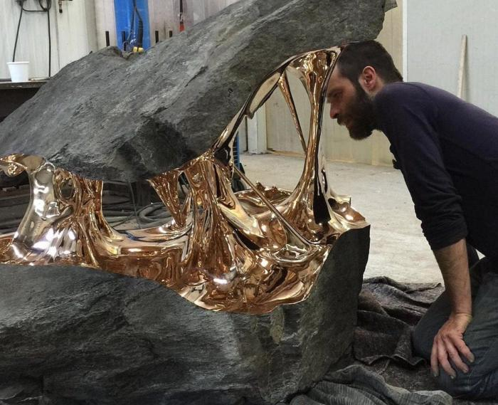

<https://news.ycombinator.com/item?id=23153778>

<https://physics.stackexchange.com/questions/148370/how-to-understand-non-associative-composition-of-velocities-in-str>

<https://physicstravelguide.com/>

<https://demystifyingscience.com/>

<https://www.quantumfieldtheory.info/>

### QM
<https://habr.com/ru/post/501858/>

<https://nautil.us/issue/83/intelligence/how-to-make-sense-of-quantum-physics>

<https://www.quantamagazine.org/mathematicians-prove-batchelors-law-of-turbulence-20200204/> Turbulence

<https://www.fermatslibrary.com/s/feynmans-proof-of-the-maxwell-equations#email-newsletter>

<https://arxiv.org/abs/2001.04797> Solid state physics

<http://www.damtp.cam.ac.uk/user/tong/kintheory/one.pdf> .  Kinetic Theory

## Maxwell

<https://github.com/photonlines/Intuitive-Guide-to-Maxwells-Equations>

<https://news.ycombinator.com/item?id=23700295>

<https://www.damtp.cam.ac.uk/user/tong/em/dyson.pdf>

<https://news.ycombinator.com/item?id=22810867>

## Chaos
<https://youtu.be/ovJcsL7vyrk>

<https://gereshes.com/2020/01/13/attracted-to-attractors/>

## youtube

https://www.youtube.com/watch?v=ovJcsL7vyrk

https://www.youtube.com/user/EugeneKhutoryansky

https://www.youtube.com/watch?v=WVSWzRdpIHs

https://www.youtube.com/results?search_query=best+physics+channel

https://www.youtube.com/user/MIT

## QED

<https://medium.com/cantors-paradise/when-feynman-met-dirac-fe9cca0006df>

<https://arxiv.org/abs/hep-th/9702027>

## QM

<https://arxiv.org/abs/quant-ph/0702225>

<https://arxiv.org/pdf/quant-ph/0702225.pdf>
